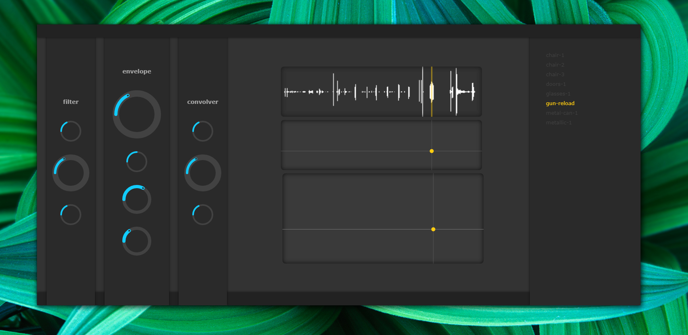

# NEBULA

[](https://travis-ci.org/nthe/nebula) Granular synthesizer based on HTML5, JavaScript and Web Audio API.



## Getting Started

These instructions will get you a copy of the project up and running on your local machine for development and testing purposes.

### Prerequisites

What things you need to install the software and how to install them

-   [NodeJS](https://nodejs.org/en/download/)
-   [Chrome](https://www.google.com/chrome/) (recommended)
-   ElectronJS - (optional) - allows running app as desktop app

```
npm install -D electron@latest
```

### Installing

Required dependencies

```
npm install
```

### Executing

Open `index.html` file in your browser, or run command below to start desktop version (requires electron-js).

```
npm run electron
```

## Running the tests

```
npm test
```

## Running the tests with coverage report

```
npm run coverage
```

Coverage report is located at `/doc/index.html`.

## Built With

Complete build (browserify + uglify)

```
npm run build
```

Browserify only

```
npm run browserify
```

## Contributing

Please read [CONTRIBUTING.md](CONTRIBUTING.md) for details on our code of conduct, and the process for submitting pull requests to us.

## Versioning

We use [SemVer](http://semver.org/) for versioning. For the versions available, see the [tags on this repository](https://github.com/nthe/elements/tags).

## Authors

-   **Juraj Onuska**

See also the list of [contributors](https://github.com/nthe/elements/contributors) who participated in this project.

## License

This project is licensed under the MIT License - see the [LICENSE.md](LICENSE.md) file for details

## Acknowledgments

-   [Ehsan Ziya](https://github.com/zya/granular) - inspiration and code base for audio engine
